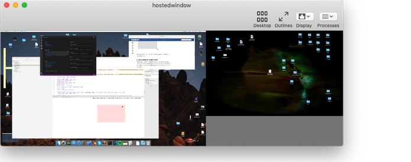
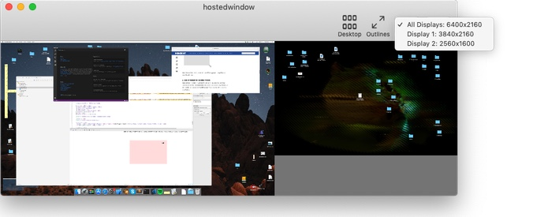
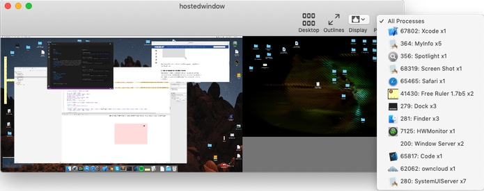
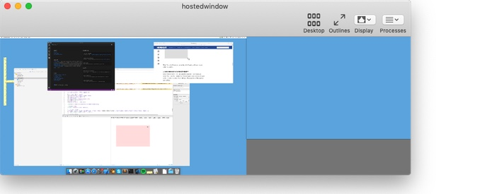
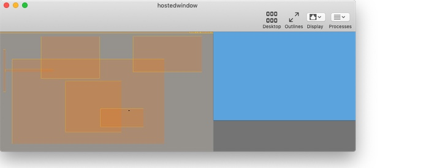

# localscreenshare
screensharing (or rather viewing) of the local screen to itself

NOTE: the preview doesn't allow control of the windows it shows...

This sample show how to use the private CAPluginLayer class to do a live preview of all the windows.  Which has little value, unless you have lots of screens connected, or in as in my case, one of the screens is 'odd' (e.g. a LookingGlass screen).
The magic of CAPluginLayer is that it has very low performance impact - any performance impact comes from the polling for window changes and of the mouse cursor image.

Should run 10.9-10.14, though I'm seeing some rendering artifacts in 10.9.

[App Download](downloads/hostedwindow.app.zip)
